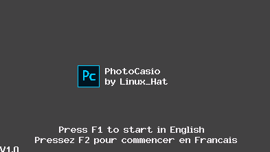

# Photocasio

Photocasio is a photo editor/creator designed for Casio Graph 90+E / Casio fx-CG50.  



This program has been tested on an emulator ([casio-emu](https://github.com/Heath123/casio-emu)) and a calculator (Casio Graph 90+E / Casio fx-CG50)

## Build

### Dependencies

- `fxsdk`
- `gint`
- `make`
- `cmake`

### Build Instructions

1. Clone the repository:

   ```
   git clone https://github.com/Linux0Hat/photocasio.git
   ```

2. Navigate to the project directory:

   ```
   cd photocasio
   ```

3. Build using `fxsdk`:

   ```
   fxsdk build-cg
   ```

## How to Use

### Introduction

Upon starting Photocasio, choose your preferred language (English or French) using the F1 and F2 keys.

### Main Menu

- **F1:** Navigate to the draw menu
- **F2:** Navigate to the text menu
- **F3:** Navigate to the images menu
- **F4:** Navigate to the images menu (not yet implemented)
- **F5:** Save/Load your project (not yet implemented)
- **F6:** Exit Photocasio

### Draw Menu

- **F1:** Use the pen
- **F2:** Use the eraser
- **F3-F4:** Adjust the radius
- **F5:** Change the color
- **F6:** Return to the main menu

### Text Menu

- **F1:** Write and place text
- **F2:** Change text color
- **F3:** Change the font
- **F6:** Return to the main menu

### RGB Menu

- **Red:** 7 to increase, 1 to decrease
- **Green:** 8 to increase, 2 to decrease
- **Blue:** 9 to increase, 3 to decrease

### Text Input Menu

- Use keys to write
- Cancel with AC/ON
- Confirm with EXE

## License

```
Photocasio © 2024 by Linux_Hat is licensed under
Attribution-NonCommercial-ShareAlike 4.0 International
```

Project maintained by Linux_Hat
